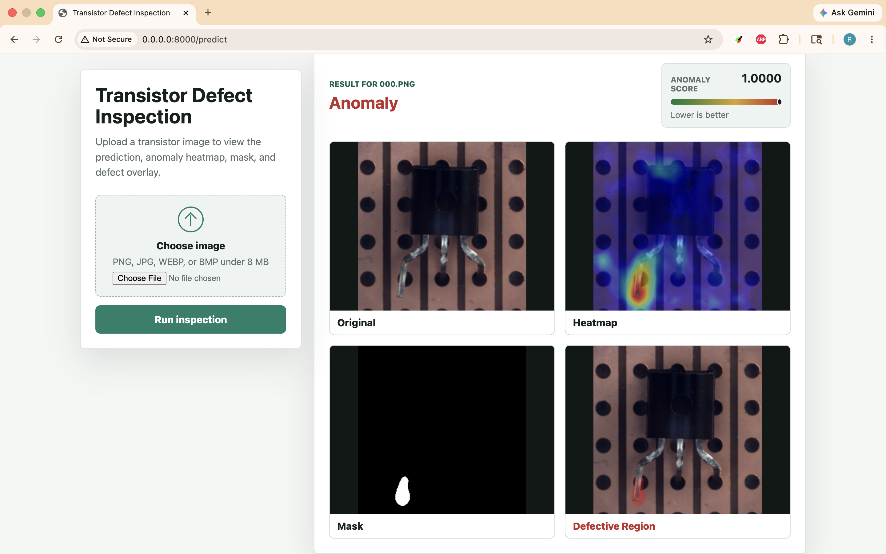
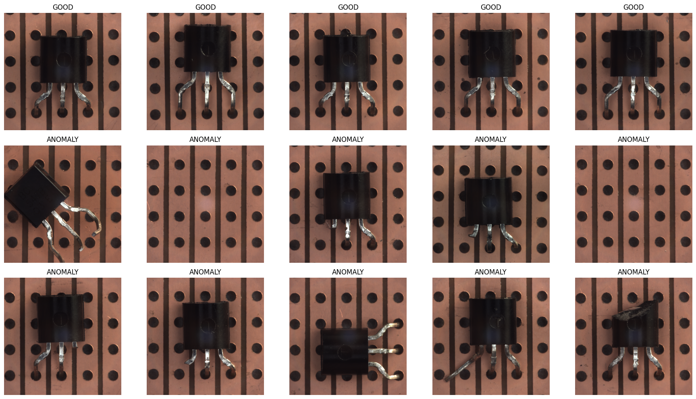
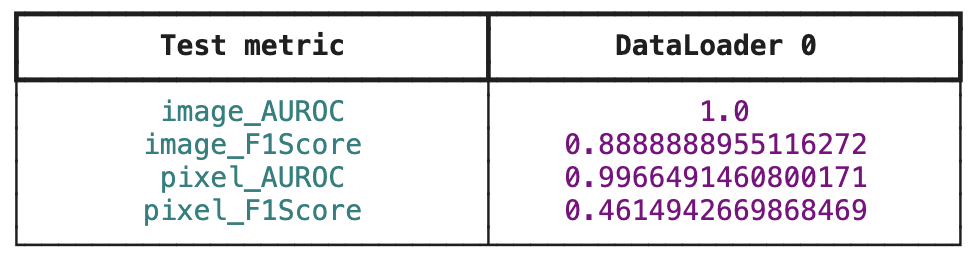
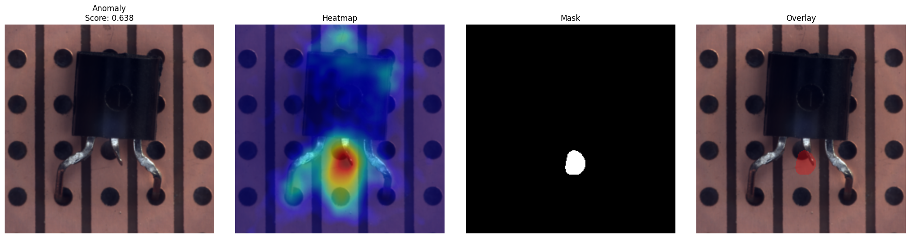

# Transistor Defect Inspection

A web-based anomaly detection application for transistor inspection using a PatchCore model with a `wide_resnet50_2` backbone. The project was built as an experiment to evaluate unsupervised visual anomaly detection on transistor images and to present the model output in a simple, inspectable UI.

The application accepts a transistor image, runs PatchCore inference, and returns the predicted defect status along with visual explanations: anomaly heatmap, predicted mask, and highlighted defective region.

## Features

- FastAPI web application for image upload and prediction.
- PatchCore anomaly detection using Anomalib.
- `wide_resnet50_2` feature extractor backbone.
- Dockerized setup with automatic model weight download from Hugging Face.
- Startup model loading so the first prediction does not pay the full model initialization cost.

## Model Configuration

The trained model uses PatchCore with the following configuration:

| Parameter | Value |
| --- | --- |
| Model | PatchCore |
| Backbone | `wide_resnet50_2` |
| Feature layers | `layer2`, `layer3` |
| Coreset sampling ratio | `0.1` |
| Number of neighbors | `9` |
| Training epochs | `3` |
| Train batch size | `8` |
| Evaluation batch size | `8` |
| Normal split ratio | `0.25` |

The model weights are stored as a PyTorch state dictionary and loaded into the same PatchCore architecture during inference.

## Input

The UI accepts a single transistor image upload.

Supported formats:

- PNG
- JPG/JPEG
- WEBP
- BMP

Maximum upload size:

- 8 MB

## Output

For each uploaded image, the application displays:

| Output | Description |
| --- | --- |
| Prediction label | `Good` or `Anomaly` |
| Anomaly score | Numeric anomaly confidence score. Lower is better. |
| Original | The uploaded transistor image. |
| Heatmap | Anomaly intensity map blended over the image. |
| Mask | Binary predicted anomaly region. |
| Defective region | Red overlay showing the suspected defective area. If no anomaly is detected, the UI shows `No Defect Detected`. |

## Demo

The repository includes demo assets that show the app workflow and sample prediction results.

### Demo Video

- GIF preview: [`demo/video/demo.gif`](demo/video/demo.gif)
- MP4 recording: [`demo/video/demo-video.mp4`](demo/video/demo-video.mp4)


### Sample Inputs

Sample transistor images are available in [`demo/sample-dataset`](demo/sample-dataset). These images can be uploaded through the web UI to try the prediction flow.

### Sample Outputs

Example prediction results are available in [`demo/output-images`](demo/output-images). They show the uploaded image alongside the generated anomaly visualizations, including the heatmap, mask, and highlighted defective region.



### Notebook Results

The training notebook can be slow to open because it contains embedded output. Key notebook results are also exported as standalone screenshots:

- Dataset samples: [`demo/notebook-screenshots/transistor-dataset-samples.png`](demo/notebook-screenshots/transistor-dataset-samples.png)
- Model metrics: [`demo/notebook-screenshots/patchcore-model-metrics.png`](demo/notebook-screenshots/patchcore-model-metrics.png)
- Prediction results: [`demo/notebook-screenshots/patchcore-prediction-results.png`](demo/notebook-screenshots/patchcore-prediction-results.png)





## Project Structure

```text
.
├── app
│   ├── main.py
│   ├── routes
│   │   └── predict.py
│   ├── services
│   │   └── inference.py
│   ├── static
│   │   └── css
│   │       └── style.css
│   ├── templates
│   │   └── index.html
│   └── weights
│       └── patchcore_model.pt
├── demo
│   ├── notebook-screenshots
│   │   ├── patchcore-model-metrics.png
│   │   ├── patchcore-prediction-results.png
│   │   └── transistor-dataset-samples.png
│   ├── output-images
│   │   ├── prediction-result-01.png
│   │   ├── prediction-result-02.png
│   │   └── prediction-result-03.png
│   ├── sample-dataset
│   │   ├── 000.png
│   │   └── ...
│   └── video
│       ├── demo-video.mp4
│       └── demo.gif
├── docker
│   └── Dockerfile
├── docker-compose.yml
├── requirements.txt
└── README.md
```

Note: local model weights are ignored by Git and Docker build context. The Docker image downloads the model weights from Hugging Face during build.

## Running With Docker

Build and start the application:

```bash
docker compose up --build
```

Open the app:

```text
http://localhost:8000
```

Stop the app:

```bash
docker compose down
```

During startup, the app logs when the model weights are loading:

```text
Loading model weights. First startup can take a while...
Model weights loaded. App is ready for predictions.
```

## Running Locally

Create and activate a virtual environment:

```bash
python3.12 -m venv .venv
source .venv/bin/activate
```

Install dependencies:

```bash
pip install --upgrade pip
pip install -r requirements.txt
```

Download the model weights:

```bash
mkdir -p app/weights
curl -L -o app/weights/patchcore_model.pt \
  https://huggingface.co/Rahul040202/patchcore-transistor-inspection/resolve/main/patchcore_model.pt
```

Start the app:

```bash
uvicorn app.main:app --reload
```

Open:

```text
http://localhost:8000
```

## Implementation Notes

- `app/services/inference.py` owns model loading, prediction, and visualization generation.
- The prediction route reads the uploaded image into memory and passes it to the inference service.
- Temporary files are used only during inference; uploaded and generated images are not persisted.
- Visualization images are encoded as base64 PNG data URLs and rendered directly in the HTML response.
- The Dockerfile downloads model weights before copying app code, allowing Docker to cache dependency and model layers across UI/code-only changes.

## Links

- Dataset: https://www.mydrive.ch/shares/150464/99b8ea0332438d64fcc2475ee73f9c29/download/420938166-1629960554/transistor.tar.xz
- Model weights: https://huggingface.co/Rahul040202/patchcore-transistor-inspection/resolve/main/patchcore_model.pt
